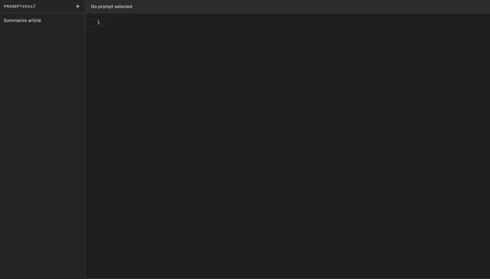
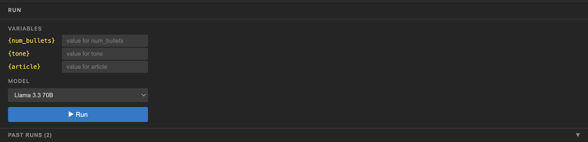
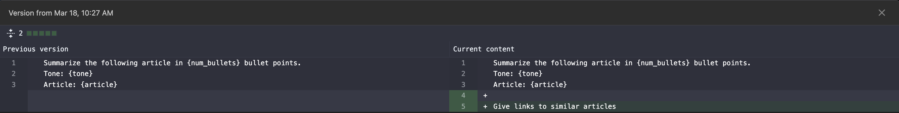

# PromptVault

A developer tool for managing, versioning, and testing AI prompts. Write prompts with `{variable}` placeholders, track every change with automatic version history, and run prompts against Gemini models — all from a single dark-themed interface.

## Features

- **Monaco Editor** — Full-featured code editor with syntax highlighting and `{variable}` placeholder highlighting in gold
- **Automatic Versioning** — Every save that changes the content creates a new version; compare any two versions side by side with a diff viewer
- **Run Panel** — Detects variables in your prompt, shows input fields for each, lets you pick a Gemini model and run instantly
- **Run History** — Past runs are saved and can be reloaded from a collapsible history section in the run panel
- **Duplicate & Export** — Duplicate any prompt with one click; export a prompt's full history (versions + runs) as JSON

## Quick Start

### Manual

```bash
# 1. Clone the repo
git clone https://github.com/you/promptvault.git
cd promptvault

# 2. Set up backend
python -m venv .venv && source .venv/bin/activate
pip install -r requirements.txt
cp .env.example .env          # add your GEMINI_API_KEY
uvicorn main:app --reload

# 3. Set up frontend (separate terminal)
cd frontend
npm install
npm run dev
```

Open http://localhost:3000 in your browser.

### Docker Compose

```bash
cp .env.example .env          # add your GEMINI_API_KEY
docker compose up --build
```

- Frontend: http://localhost:5173
- Backend API: http://localhost:8000

## Screenshots

| Editor | Run Panel | Version Diff |
|--------|-----------|--------------|
|  |  |  |

> Screenshots coming soon — see `docs/screenshots/` for placeholder.

## Tech Stack

| Layer | Technology |
|-------|-----------|
| Backend | FastAPI, SQLAlchemy 2, SQLite, python-dotenv |
| AI | Google Gemini via OpenAI-compatible API (`gemini-2.0-flash`, `gemini-2.5-pro`, `gemini-1.5-flash`) |
| Frontend | React 19, TypeScript 5, Vite 8 |
| Editor | `@monaco-editor/react` |
| Diff View | `react-diff-viewer-continued` |
| HTTP | Axios |
| Styling | CSS Modules (dark VS Code–inspired theme) |
| Containers | Docker, nginx (multi-stage build) |

## Why I Built This

Prompt engineering is iterative — you tweak a sentence, run it, tweak again, and forget what you changed three versions ago. PromptVault treats prompts like code: every change is versioned, every run is logged, and you can always diff back to see what broke (or what worked).
